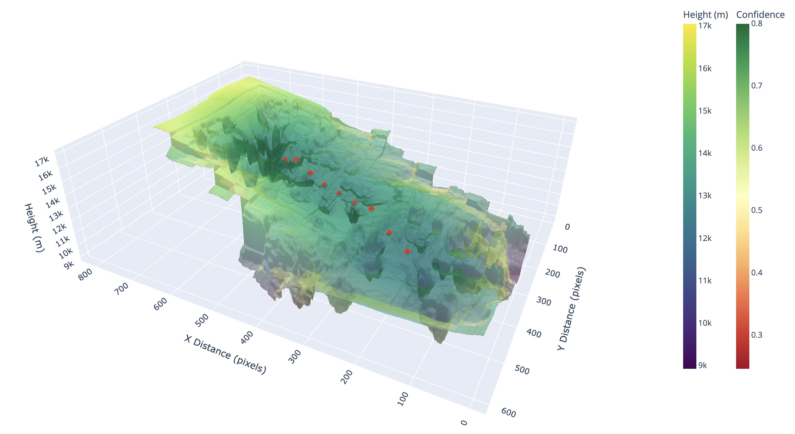

cloud2cloud Source Files
==============================

### Due to this project being heavily research-oriented, the majority of the files are Jupyter notebooks, with some resource and utility Python files.
---

---
# Documented Jupyter notebooks

## RAFT
* [Final RAFT height calculator stitching](https://github.com/cloud-2-cloud/c2c/blob/main/RAFT/final_RAFT_height_calculator_stitching.ipynb)
  - RAFT fine-tuning, height field generation, and stitching with images. Too large to display in GitHub without downloading.
* [Final RAFT height calculator stitching no output](https://github.com/cloud-2-cloud/c2c/blob/main/RAFT/final_RAFT_height_calculator_stitching_no_output.ipynb)
  - RAFT fine-tuning, height field generation, and stitching with no output. Can be viewed in GitHub without downloading the notebook.
* [RAFT appendix](https://github.com/cloud-2-cloud/c2c/blob/main/RAFT/raft_appendix.pdf)
  - The technical information from the RAFT notebook in LaTeX format.

## CNN RNN
* [Final CNN RNN LiDAR point](https://github.com/cloud-2-cloud/c2c/blob/main/cnn_rnn/final_CNN_RNN_LiDAR_point.ipynb)

# Notebooks

## Lucas Kanade Optical Flow
* [EDA Conv Next Gradient Deep Dive](https://github.com/cloud-2-cloud/c2c/blob/main/Lucas_Kanade_Optical_Flow/EDA_Conv_Next_Gradient_Deep_Dive.ipynb)
* [Initial Image Pixel EDA And Corner Detection](https://github.com/cloud-2-cloud/c2c/blob/main/Lucas_Kanade_Optical_Flow/Initial_Image_Pixel_EDA_And_Corner_Detection.ipynb)
* [LK Tracking Fisheye Corrections And Center Predictions](https://github.com/cloud-2-cloud/c2c/blob/main/Lucas_Kanade_Optical_Flow/LK_Tracking_Fisheye_Corrections_And_Center_Predictions.ipynb)

## MiDAS
* [MiDaS](https://github.com/cloud-2-cloud/c2c/blob/main/MiDAS/MiDaS.ipynb)
* [MiDaS no output](https://github.com/cloud-2-cloud/c2c/blob/main/MiDAS/MiDaS_no_output.ipynb)

## TV L1 Optical Flow
* [Center Points TV L1](https://github.com/cloud-2-cloud/c2c/blob/main/TV_L1_Optical_Flow/Center_Points_TV_L1.csv)
* [Create 3D Mesh v2](https://github.com/cloud-2-cloud/c2c/blob/main/TV_L1_Optical_Flow/Create_3D_Mesh_v2.ipynb)
* [Get Height For Entire Video v1](https://github.com/cloud-2-cloud/c2c/blob/main/TV_L1_Optical_Flow/Get_Height_For_Entire_Video_v1.ipynb)
* [Get Height of Center Points 1](https://github.com/cloud-2-cloud/c2c/blob/main/TV_L1_Optical_Flow/Get_Height_of_Center_Points_1.ipynb)
* [TV L1 Visualization](https://github.com/cloud-2-cloud/c2c/blob/main/TV_L1_Optical_Flow/TV_L1_Visualization.ipynb)

## CNN RNN
* [Conv-next-feature-extraction (HTML)](https://github.com/cloud-2-cloud/c2c/blob/main/cnn_rnn/conv-next-feature-extraction.html)
* [Conv-next-feature-extraction (Notebook)](https://github.com/cloud-2-cloud/c2c/blob/main/cnn_rnn/conv-next-feature-extraction.ipynb)

# Data Processing
* [Aircraft metadata processor](https://github.com/cloud-2-cloud/c2c/blob/main/data_processing/aircraft_metadata_processor.ipynb)
* [Cloud2cloud preprocessor](https://github.com/cloud-2-cloud/c2c/blob/main/data_processing/cloud2cloud_preprocessor.ipynb)
* [Fisheye](https://github.com/cloud-2-cloud/c2c/blob/main/data_processing/fisheye.ipynb)
* [LiDAR processor](https://github.com/cloud-2-cloud/c2c/blob/main/data_processing/lidar_processor.ipynb)
* [Resize crops](https://github.com/cloud-2-cloud/c2c/blob/main/data_processing/resize_crops.ipynb)
* [Video processor](https://github.com/cloud-2-cloud/c2c/blob/main/data_processing/video_processor.ipynb)
* [Video processor TF In Memory](https://github.com/cloud-2-cloud/c2c/blob/main/data_processing/video_processor_TF_In_Memory.ipynb)

# Resources
* [Cloud2cloud ConvNext](https://github.com/cloud-2-cloud/c2c/blob/main/resources/cloud2cloud_ConvNext.py)
* [Cloud2cloud data class](https://github.com/cloud-2-cloud/c2c/blob/main/resources/cloud2cloud_data_class.py)
* [Resize crops](https://github.com/cloud-2-cloud/c2c/blob/main/resources/resize_crops.py)

---

File Organization
------------
```
.
├── Lucas_Kanade_Optical_Flow
│             ├── EDA_Conv_Next_Gradient_Deep_Dive.ipynb
│             ├── Initial_Image_Pixel_EDA_And_Corner_Detection.ipynb
│             └── LK_Tracking_Fisheye_Corrections_And_Center_Predictions.ipynb
├── MiDAS
│             ├── MiDaS.ipynb
│             └── MiDaS_no_output.ipynb
├── RAFT
│             ├── final_RAFT_height_calculator_stitching.ipynb
│             ├── final_RAFT_height_calculator_stitching_no_output.ipynb
│             └── raft_appendix.pdf
├── TV_L1_Optical_Flow
│             ├── Center_Points_TV_L1.csv
│             ├── Create_3D_Mesh_v2.ipynb
│             ├── Get_Height_For_Entire_Video_v1.ipynb
│             ├── Get_Height_of_Center_Points_1.ipynb
│             └── TV_L1_Visualization.ipynb
├── cnn_rnn
│             ├── conv-next-feature-extraction.html
│             ├── conv-next-feature-extraction.ipynb
│             └── final_CNN_RNN_LiDAR_point.ipynb
├── data_processing
│             ├── aircraft_metadata_processor.ipynb
│             ├── cloud2cloud_preprocessor.ipynb
│             ├── fisheye.ipynb
│             ├── lidar_processor.ipynb
│             ├── resize_crops.ipynb
│             ├── video_processor.ipynb
│             └── video_processor_TF_In_Memory.ipynb
└── resources
    ├── cloud2cloud_ConvNext.py
    ├── cloud2cloud_data_class.py
    └── resize_crops.py
```
